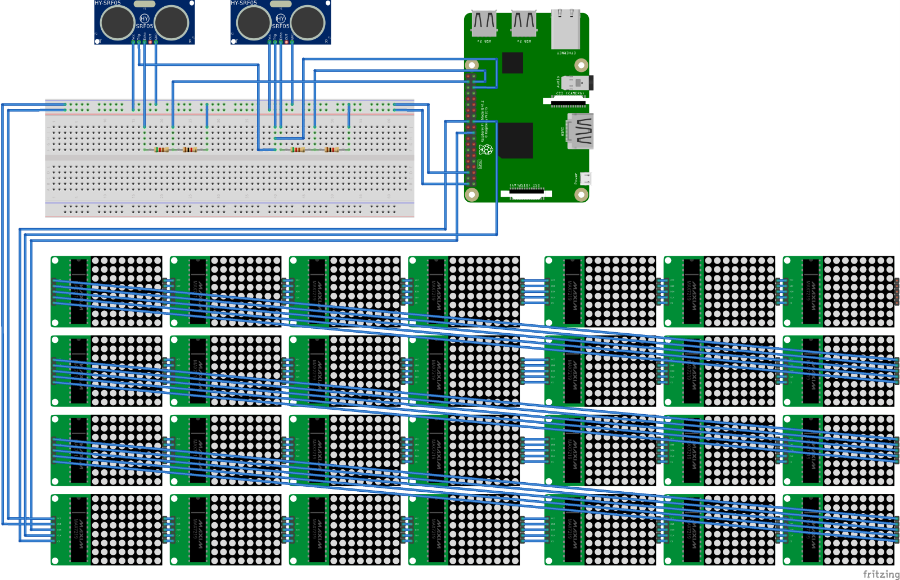

# Raspberry Pi Powered Pong Game.

## Hardware

### Input
**2 x HC-SR 04 ultra sonic range sensor**

Both range sensors share one trigger signal from the PI.  
The 5V echo pins from the sensors are connected back to the Pi via voltage dividers. 

### Display
**28 x MAX7219 based 8x8 LED panels**

The LED panels are controlled by a SPI like interface.  
All panels are daisy-chained together. So the complete display can be updated with 8 consecutive SPI bus writes.  
Each write will update 1 row off all the 28 connected panels. The LED data is written by using the SPI bus, 
except that the internal SPI_CS signal of the bus will not be used and instead a custom CS signal will load 
the data into the MAX7219 after the full transfer for one row of all panels is complete.

## Software

Hardware interface is realised by using pigpio library.

    sudo apt-get update
    sudo apt-get install pigpio

See http://abyz.me.uk/rpi/pigpio/index.html for more infos about pigpio.

**RangeController**  

A background thread with an endless loop is sending a 10µs pulse on the trigger pin every 60ms.  
(Sending in a faster interval led to unreliable results)

Two callback are registered for both echo pins measuring the echo pulse length. 
The pulse length multiplied by the speed of sound and divided by 2 (for the round trip) 
will give us the measured distance for each sensor. The pigpio library helps a lot here, because it 
timestamps all changes on the GPIOs.

**LedController**  

The LedController handles the communication with the LED panels. Basically it will transfer the bitmasks for 
all led panels via SPI. For one panel it will be a regular data transfer via SPI, but since we daisy chained all the 
panels, we need to customise the protocol. We can load the complete chain of LED panels with one SPI transfer if
we manually toggle the CS pin. So we pull down the CS, transfer data for all panels and raise CS again to load the data
into the LED. 

**FrameBuffer**  

The FrameBuffer keeps track of the display data. The internal memory layout is matching hte LED panel chain. 
In addition it provides logical access via "screen" coordinates. 

**Text/BinaryDisplay**  

Helper classes to write text or draw lines onto the FrameBuffer

**Game**  

Pong! A field, two tennis rackets and a ball.
 
